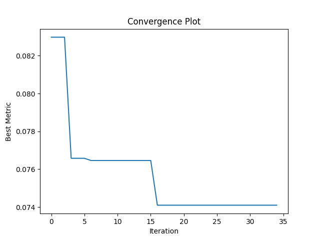

# Bayesian Optimization of a Neural Network



## Overview
This project demonstrates the use of Bayesian Optimization with GPyOpt to optimize the hyperparameters of a simple neural network model. The goal is to find the best combination of learning rate, number of units in a hidden layer, dropout rate, L2 regularization, and batch size to minimize the model's validation loss.

## About Me
Hello! I'm Santiago Echeverri, a passionate machine learning enthusiast with a keen interest in optimization techniques. You can learn more about me on [LinkedIn](https://www.linkedin.com/in/santye), follow me on [Twitter](https://twitter.com/da_ssantoss), or explore my other projects on my [Portfolio](https://github.com/dassantoss).

## Project Structure
- `optimize_model.py`: The main script that performs Bayesian Optimization.
- `bayes_opt.txt`: Contains the best hyperparameters found during optimization and their corresponding performance.
- `convergence_plot.png`: A plot showing the convergence of the optimization process over iterations.
- `model_checkpoints/`: Directory where the model checkpoints are saved during optimization (empty in the repo).
  
## Installation
To run this project, you need to have Python installed along with the following dependencies:
```bash
pip install GPyOpt tensorflow matplotlib
```

## Usage
1.	Run the Optimization:

Execute the optimize_model.py script to start the optimization process:
To run the optimization, execute the `optimize_model.py` script:
```bash
python optimize_model.py
```
This will perform the optimization over 30 iterations and save the results in `bayes_opt.txt` and `convergence_plot.png`.

2. Review the Results:
- Open `bayes_opt.txt` to see the best hyperparameters found.
- Open `convergence_plot.png` to visualize the convergence of the optimization process.

## Development Story
This project began as a simple exploration into hyperparameter tuning, but quickly evolved into a full-scale application of Bayesian Optimization using GPyOpt. The goal was to leverage the power of Gaussian Processes to efficiently explore the hyperparameter space and improve model performance.

## Features Implemented
- Bayesian Optimization using GPyOpt
- Early stopping to prevent overfitting
- Checkpointing of the best model at each iteration
- Convergence plotting to visualize the optimization process

## Features to be Implemented
- Integration with more complex models (e.g., CNNs, RNNs)
- Parallelization of the optimization process for faster results
- Exploration of different acquisition functions beyond Expected Improvement (EI)

## Challenges Encountered
One of the biggest challenges was setting up the Bayesian Optimization process to work efficiently with the neural network model. Balancing exploration and exploitation of the hyperparameter space required careful tuning of the acquisition function and early stopping criteria.

## Results
The best hyperparameters found during optimization are listed in `bayes_opt.txt`, with a validation loss of `0.07532311975955963`.

### Example of the Best Hyperparameters:
- Learning Rate: 0.05173
- Units: 64
- Dropout: 0.43297
- L2 Regularization: 0.00827
- Batch Size: 64

## License
This project is licensed under the MIT License - see the LICENSE file for details.

## Contact
For any questions or inquiries, please contact Santiago Echeverri at [santiago.echeverri@devarea.mx](mailto:santiago.echeverri@devarea.mx).
